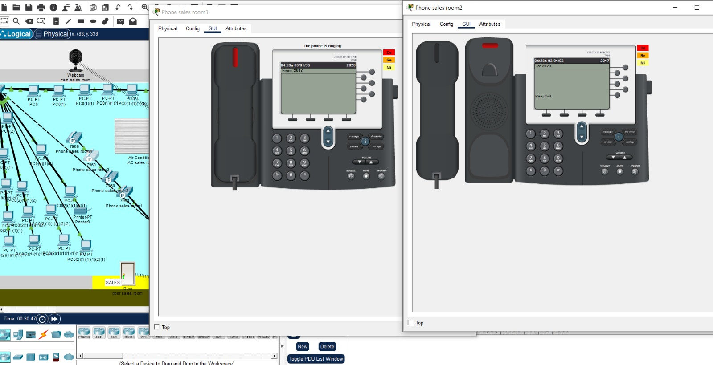
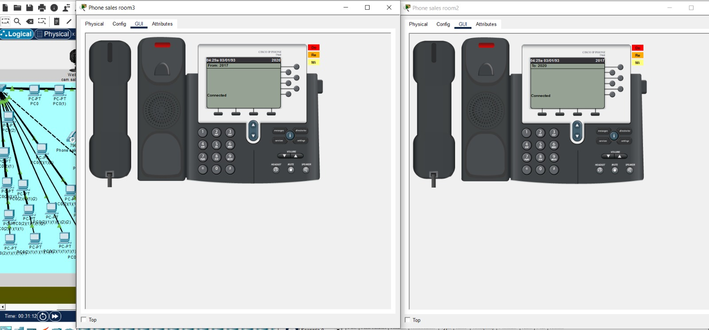

# Secure & Smart Enterprise Network Architecture

A comprehensive, end-to-end secure enterprise network infrastructure designed and simulated using **Cisco Packet Tracer**. This project demonstrates advanced skills in network design, dynamic routing, enterprise services deployment, multi-site VoIP integration, smart IoT automation, and a robust 6-layer security framework.

---

## 📌 Project Overview
* **Project Name:** Building a Secure Network for a Smart Company
* **Simulation Tool:** Cisco Packet Tracer
* **Status:** Fully Verified & Documented (Graduation Project Milestone)

---

## 🌐 Network Topology
Below is the architectural layout of the enterprise network, featuring the Head Office (HQ), Branch Office, and specialized security zones:

---

## 🛠️ Key Architecture & Features

### 1. VLAN Segmentation & Logical Layout
* **Headquarters (HQ):** Driven by an **L3 Core Switch (3560-24PS)** running Inter-VLAN routing via SVIs. Features 11 distinct VLANs segregating departments such as Accounts (A/B), Planning, Managers, HR, Call Center, IT/PR, Marketing, Sales, Server Farm (VLAN 100), and Voice (VLAN 200).
* **Branch Office:** Configured with 5 corporate VLANs managed via a **Branch Router** utilizing Router-on-a-Stick (Sub-interfaces).
* **Inter-site Routing:** WAN connectivity between HQ and Branch is established dynamically using the **OSPF** routing protocol.

---

### 2. Core Enterprise Services
* **Centralized DHCP Server:** Set up on a dedicated server (`Server0`) inside HQ, dynamically assigning IPs to 150+ hosts. Leveraged `ip helper-address` on the L3 Core Switch to relay broadcasts across multiple VLAN subnets.
* **Corporate Email Server:** Runs locally under the domain `enterprise.local` using secure internal **SMTP** (Port 25) for transmission and **POP3** (Port 110) for retrieval.
* **FTP Archive Server:** Operating on Ports 20 & 21, utilized for central digital archiving and automating configuration backups (`running-config`) for critical routers and switches.
* **Web Server (HTTP/HTTPS):** Serves as an internal portal and a live-test platform to verify end-to-end routing and firewall translation accuracy.

---

### 3. Voice over IP (VoIP) & Smart IoT Integration

#### 📞 Enterprise VoIP
High voice quality guaranteed by separating voice traffic into dedicated subnets (**VLAN 200** in HQ and **VLAN 50** in Branch) with high priority. Implemented **DHCP Option 150** to point IP phones to the **CME (Call Manager Express)** server for automatic DN registration. Multi-site dialing is enabled via optimized **Dial-Peers**.

  
  

#### 🏠 Smart Corporate IoT
Integration of 29 smart assets connected wirelessly via a **Home Gateway**. Fully monitored and managed dynamically through an HTTP Dashboard on the administrator’s smartphone.

  
  
  

---

## 🔒 6-Layer Security Framework
The infrastructure adopts a defense-in-depth approach through six strategic layers:
1. **Cisco ASA Firewall Implementation:** Deployed at the edge boundary to inspect and filter all traffic crossing the *Inside* (trusted) and *Outside* (untrusted internet) security zones.
2. **Access Control Lists (ACLs):** Applied the restrictive `PROTECT_SERVER` policy on the L3 Core Switch, isolating the Server Farm from general departments while strictly granting access only to IT, PR, and Executive Management.
3. **Port Security (Mac Address Sticky):** Deployed on the sensitive Server Farm access switch (**Switch 2**). Automatically binds port interfaces to specific MAC addresses and triggers an immediate `Err-disabled` shutdown upon detecting rogue hardware.
4. **RADIUS Centralized Authentication:** Enforced centralized access control utilizing AAA architecture for network operators, with local credentials maintained exclusively as an emergency Fallback mechanism.
5. **Secure Remote Access:** Blocked vulnerable Telnet sessions entirely; administrative management across all infrastructure nodes is encrypted exclusively using **SSH v2**.
6. **Network Address Translation (NAT/PAT):** Enabled dynamic PAT at the edge to encapsulate internal network spaces behind a single, secure Public IP, maximizing security and resource utility.

---

## 📊 Verification & Testing
* **24 Comprehensive Test Cases:** Executed and validated successfully. Tests include department-to-department isolation, server access blacklists, email routing reliability, external web reachability, inter-site VoIP calling, and rogue device port isolation.
* **Technical Challenges Resolved:** Successfully resolved standard constraints involving DHCP cross-VLAN broadcast routing, inter-site dial-peer translation parameters, and dynamic PAT mapping overhead on the ASA platform.

---

## 🚀 Future Roadmap
* **IPv6 Transition:** Introduce Dual-Stack topologies to support next-generation IP allocation.
* **High Availability (HA):** Implement **HSRP** (Hot Standby Router Protocol) to eliminate single points of failure.
* **Advanced Edge Routing:** Integrate **BGP** for redundant Multi-Homing Internet Service Provider links.
* **Next-Gen Wireless Security:** Upgrade the IoT and corporate wireless framework to **WPA3 Enterprise**.

---
*This repository is maintained for engineering documentation and architectural evaluation purposes.*